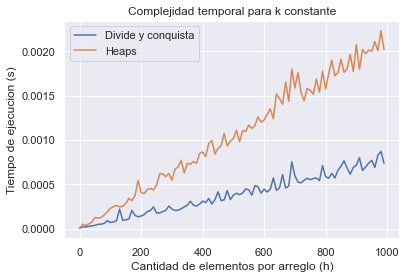
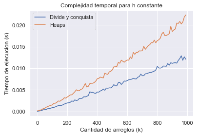

# Trabajo Práctico 1

## Integrantes:

| Nombre         | Padrón | Email               |
| -------------- | ------ | ------------------- |
| Manuel Sanchez | 107951 | msanchezf@fi.uba.ar |
| Ian Shih       | 108349 | ishih@fi.uba.ar     |

## Primera parte

### División y conquista

#### Complejidad segun Teorema Maestro

Al ser un algoritmo que hace uso del concepto de división y conquista, para calcular la complejidad podemos usar el
Teorema Maestro. Para ello, debemos establecer los valores de $A$, $B$ y $C$ en la ecuacion de recurrencia de forma $T(
N) = A*T(N/B) + f(N)$.

- $A$ es la cantidad de llamados recursivos. En este caso, se puede observar claramente como hay 2 llamados recursivos,
  uno por cada mitad del arreglo de arreglos. Consecuentemente, quedaria $A = 2$.
- $B$ es en cuanto se divide el subproblema por cada llamado recursivo. El problema es dividido en 2 por cada llamado ya
  que cada uno de estos recibe una mitad del arreglo de arreglos. Por lo tanto, concluimos que $B = 2$.
- $f(n)$ es el coste de las operaciones no recursivas. Estas operaciones son `split` y `merge`.

    - `split`: Su funcion es dividir el arreglo de arreglos en 2, y retornar una tupla con cada mitad. Al estar usando
      python, la complejidad de hacer un slice es $O(h)$, siendo $h$ la cantidad de elementos en el arreglo de arreglos,
      por lo cual esa es la complejidad de este algoritmo.
    - `merge`: Esta funcion se encarga de combinar 2 arreglos de numeros de forma que el orden ascendente se mantenga.
      Eventualmente, el algoritmo va a llegar a un punto donde va a tener 2 arreglos, cada uno con la mitad de elementos
      totales y tendra que combinar ambos. Este es el peor caso del algoritmo, en cuyo caso debe hacer $N$
      comparaciones, siendo $N=k*h$ (con $k$ siendo la cantidad de arreglos y $h$ la cantidad de elementos por arreglo).

  En consecuencia, el coste no recursivo es $O(N)$ con $N$ siendo la cantidad de elementos totales. En este caso del
  Teorema Maestro, podemos buscar un valor para $C$ de forma que $O(N^C) = O(N)$. Resolviendo esta simple igualdad,
  llegamos a $C=1$.

Considerando todo esto, caemos en el segundo caso del Teorema Maestro, donde $A = B^C$. En conclusion, la complejidad
del algoritmo segun el Teorema Maestro es $O(N^C * log(N))$ que es igual a $O(N * log(N))$. Reemplazando $N = kh$,
obtenemos $O(kh * log(kh))$.

### "El algoritmo que usa heaps"

#### Descripcion

"El algoritmo que usa heaps" es un algoritmo que permite hacer un _merge_ de $k$ arreglos haciendo uso de un _min-heap_.
Para ello, sigue los siguientes pasos:

1. Insertar el primer elemento de cada arreglo en el heap. Es importante mantener un registro de a que arreglo
   pertenecia dicho elemento.
2. Extraer la raiz del heap e insertarla en un arreglo.
3. Extraer otro elemento del arreglo al que pertenecía la raiz antes de ser insertada al heap.
4. Insertar este nuevo elemento al heap.
5. Repetir desde el paso 2 hasta que no queden mas elementos en ningun arreglo.

#### Complejidad

En nuestra implementacion, dicho algoritmo esta compuesto por:

- `initialize_heap`: Esta funcion se encarga de recorrer todos los arreglos e insertar el primer elemento de cada uno de
  ellos en una lista, lo cual tiene una complejidad temporal de $O(k)$. Luego, a esta lista se le hace _heapify_ para
  transformarla en un _min-heap_, lo cual tiene la misma complejidad temporal, $O(k)$. Por ello, esta funcion tiene una
  complejidad temporal de $O(k)$.
- `push_next`: Esta funcion inserta el siguiente elemento del arreglo donde se encontraba la raiz del heap previa a ser
  insertada al mismo. Si este arreglo no tiene mas elementos, inserta infinito en el heap, de forma que este se hunda
  hacia el fondo del todo. Insertar un elemento a un heap, usando `heapq.heappush` tiene una complejidad de $O(log(k))$.
- `HeapElement`: Todos los metodos de esta clase tienen una complejidad de $O(1)$.
- `kmerge`: Esta es la funcion principal que se encarga de combinar multiples arreglos. Primero, llama
  a `initialize_heap` que tiene una complejidad $O(k)$. Luego entra en un `while` que itera mientras la longitud del
  arreglo resultado sea menor a la cantidad total de elementos, es decir, $k*h$ veces que es igual a $N$ veces. Dentro
  del `while`, se realizan 3 operaciones:

    - Se extrae la raiz del heap (valor minimo) usando `heapq.heappop`, el cual tiene una complejidad de $O(log(k))$.
    - Se inserta un nuevo elemento al heap usando `push_next`, el cual tiene una complejidad de $O(log(k))$.
    - Se concatena el valor minimo al arreglo de resultado, lo cual tiene una complejidad de $O(1)$.

  En total, la complejidad obtenida dentro del `while` es $O(log(k))$, y repitiendolo $k*h$ veces, resulta en una
  complejidad de $O(k h * log(k))$.

### Complejidad real de DyC

El problema con la complejidad hallada es que no se condice con los graficos creados. La complejidad obtenida en el
algoritmo de heaps es $O(k h * log(k))$, mientras que la del algoritmo de DyC es $O(k h * log(k h))$. Es decir, la
complejidad temporal del algoritmo de heaps es menor. Sin embargo, esto no se ve reflejado en los graficos.

En estos graficos se puede apreciar como la complejidad del algoritmo de heaps aparenta ser mayor a la del algoritmo de
división y conquista.

El problema con la complejidad obtenida es que segun la misma, el factor $log(kh)$ indica que la cantidad de llamados
recursivos depende tanto de la cantidad de listas ($k$), como la cantidad de elementos ($h$). Sin embargo, esto esta
lejos de la realidad ya que la recursividad del algoritmo solo depende de la cantidad de arreglos y no de la cantidad de
elementos. El arreglo de arreglos es el que se divide a la mitad, y unicamente se considera la cantidad de arreglos en
la condicion de corte, por lo que solo el valor $k$ entraria en la ecuacion para calcular la cantidad de llamados
recursivos.

La cantidad de elementos entra en juego unicamente en las operaciones de `merge` y `split`. El peor caso de `merge` es
tener que combinar 2 arreglos con $kh/2$ elementos cada uno. Por el otro lado, el peor caso de `split` es tener que
crear 2 slices de $kh/2$ elementos cada uno. Ambas operaciones se puede acotar asintoticamente con $O(kh)$.

Teniendo esto en cuenta, la complejidad total del algoritmo deberia ser $O(kh*log(k))$.

La razon por la cual el Teorema Maestro dio un resultado incorrecto es porque para poder aplicarlo, se deben cumplir las
siguientes condiciones:

1. A es natural.
2. B es real mayor a 1, y es constante (siempre el mismo).
3. El caso base es constante.

No obstante, la tercera condicion no se cumple. Esto se debe a que hay 2 casos base distintos segun la longitud del
arreglo de arreglos:

- Cuando es 1: se devuelve el unico arreglo dentro del mismo, cuya complejidad es $O(1)$.
- Cuando es 2: se hace un `merge` entre los 2 arreglos, cuya complejidad es $O(n)$.

Por esta razon, al aplicar teorema maestro, obtenemos un resultado incorrecto.

## Segunda parte: Problema del contrabando

### Greedy

El algoritmo greedy hace los siguientes pasos:

1. Ordenar de mayor a menor los paquetes de cada producto de la mercaderia
2. Por cada producto de la mercaderia
    1. Tomar un paquete y fijarse si alcanza para pagar todo el soborno
        1. Si alcanza, me lo guardo como optimo local. Si encuentro otro que ajuste mejor al soborno deseado, cambio el
           optimo local por este nuevo.
        2. Si no alcanza, lo agrego a la solucion
3. Repetir desde 1 con el siguiente producto hasta que haber pagado todo el soborno

El algoritmo es unicamente capaz de optimizar el ultimo paquete de cada producto. Si un paquete no alcanza para pagar el
soborno, se agrega a la solucion y se pasa al siguiente paquete. Es decir, cuando no alcanza, siempre toma el mas
grande. Esta es la parte donde falla y no es optimo. Sin embargo, por esta misma razon es lo que lo hace greedy, la
solucion mas "voraz" siempre va a ser la que reduzca el soborno lo mas "rapido" posible.

### Programacion dinamica

#### Descripcion general

Analizando el problema detalladamente, nos damos cuenta que es similar al problema de la mochila (y al de subset sum),
aunque a diferencia de la mochila, tenemos mas de una "mochila" y no tenemos la posibilidad de dejarle menos unidades de
los que nos pide el funcionario, tenemos que darle mas o la misma cantidad. Con estas consideraciones, diseñamos el
siguiente algoritmo:

1. Por cada producto:
    1. Creamos una matriz de soluciones, donde las filas son los paquetes y las columnas son los valores del soborno
       para cada subproblema.
    2. Iteramos cada celda de la matriz, llenando cada una con la solucion al subproblema, para ello:
        1. Buscamos la cantidad de productos que **minimice** la diferencia entre la cantidad y el soborno, considerando
           que debe ser mayor o igual al soborno.
        2. Se elige entre el subproblema de no usar el paquete actual y el subproblema de usarlo pero considerando un
           soborno menor y un paquete menos.
    3. Se reconstruye la solucion a partir de la matriz generada.

### Complejidad

Se establecen las siguientes variables:

- $n$: Cantidad **maxima** de paquetes por producto
- $k$: Cantidad de productos
- $s$: Soborno **maximo** pedido

#### Greedy

Para el algoritmo greedy, ordenamos los paquetes de mayor a menor por cada producto e iteramos los paquetes de cada
producto.

Ordenar los paquetes de cada producto cuesta $O(n * log(n))$, resultando en que la funcion `ordernar_mercaderia`
cueste $O(k n * log(n))$

Iterar los paquetes de cada producto cuesta $O(k * n)$ debido a que las instrucciones ejecutadas en el ciclo se hacen en
tiempo constante

Esto resulta en un algoritmo con complejidad total de $T(n, s, k) = O(k n * log(n)) + O(k * n) = O(k n * log(n))$

Tambien se diseño el mismo algoritmo greedy, pero esta vez ordenando los paquetes de menor a mayor.

#### Dinamica

Por **cada producto**, construimos una matriz de $s$ columnas y $n$ filas, la iteramos y luego reconstruimos la solucion
en base a la matriz.

Construir una matriz $s_n$ cuesta $O(s * n)$ lo mismo es iterarlo (todas las instrucciones se ejecutan en tiempo
constante).

Reconstruir la solucion tiene una complejidad de $O(n)$ debido a que se recorre el arreglo de paquetes, buscando cuales
se usaron y cuales no.

El algoritmo para calcular los paquetes optimos para **un producto** resulta en $T(n, s) = O(s * n) + O(s * n) + O(n) =
O (s * n)$

Esto resulta en un algoritmo con complejidad total de $T(n, s, k) = O(k * s * n)$

### Deficiencias de algoritmo greedy

Como se menciono anteriormente, al solo ser capaz de optimizar el **ultimo** paquete, en casos donde la solucion
optima **no** tiene en cuenta el paquete de mayor siempre va a fallar el algoritmo greedy

Ejemplo:

Cuando tengo los siguientes paquetes `[8, 6, 5]` y se pide un soborno de 11 unidades, nuestro algoritmo
devolvera `[8, 5]`
porque siempre se tiene en cuenta el mas grande

Para el algoritmo greedy de minimos, para los casos donde el paquete mayor pertenezca a la solucion optima, se va a
alejar mucho del optimo. Esto es debido a que los paquetes mas pequeños se van a acercar mucho al soborno pedido, pero
si no llegan, se utilizan paquetes con mayor cantidad y terminamos pagando mucho mas de lo pedido

Ejemplo:

Suponiendo los paquetes `[5, 6, 8]` y se pide un soborno de 12 unidades, el algortimo greedy por minimos eligiria los 3
paquetes

### Generacion de set de datos

Para la generacion de set de datos, se establece un $k$ y un $n$, por cada $k$ se crea un producto y se genera un
arreglo aleatorio de tamaño $n$, de ese arreglo se seleccionan $n // 3$ elementos que van ser nuestro soborno para ese
producto.

El resultado correcto sera el resultado donde la suma de las cantidades de los paquetes sea igual al soborno determinado
para el producto, sabemos que siempre se encontrara el optimo (para el caso de la solucion con programacion dinamica)
porque el soborno se elige del mismo arreglo.

(Definido en `utils.py`)
